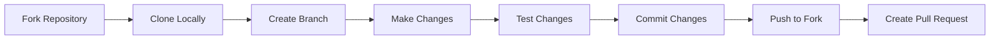

# Contributing to Craft Fusion

Thank you for your interest in contributing to Craft Fusion! This document provides guidelines and instructions for contributing to the project.

## Code of Conduct

By participating in this project, you agree to abide by our code of conduct. Please be respectful, considerate, and constructive in all interactions.

## Development Process

### Setting up Development Environment

Please follow the instructions in [installation.md](./docs/installation.md) to set up your development environment.

### Branch Strategy

- `main` - Contains stable production code
- `develop` - Integration branch for new features
- Feature branches - Named as `feature/feature-name`
- Bug fix branches - Named as `fix/bug-description`

### Pull Request Process

1. Create a new branch from `develop` for your changes
2. Implement your changes following our [coding standards](./docs/CODING-STANDARDS.md)
3. Write tests for your changes
4. Update documentation as necessary
5. Submit a pull request to the `develop` branch
6. Wait for code review and address any feedback

### Commit Guidelines

We follow the [Conventional Commits](https://www.conventionalcommits.org/) specification:

- `feat`: A new feature
- `fix`: A bug fix
- `docs`: Documentation changes
- `style`: Code style changes (formatting, etc.)
- `refactor`: Code refactoring
- `test`: Adding or modifying tests
- `chore`: Maintenance tasks

Example: `feat(craft-web): add new dashboard component`

## Testing Guidelines

- Write unit tests for all new code
- Ensure existing tests pass before submitting a PR
- Update tests when modifying existing functionality
- Aim for at least 80% test coverage for new code

## Documentation Guidelines

- Update relevant README files for any changed components
- Document new features in appropriate documents
- Follow our markdown standards (see [CODING-STANDARDS.md](./docs/CODING-STANDARDS.md))
- Include code examples when appropriate

## Refactoring

For major refactoring efforts, please create a prompt file in the `prompts/` directory following our [feature refactoring strategy](./prompts/feature-refactoring-strategy.md).

## Your First Contribution

We warmly welcome new contributors! Contributing to a project for the first time can feel intimidating, but we're here to make it a positive, rewarding experience.

### 🌱 Perfect First Contributions

Start with these contribution types to build your confidence:

- **Documentation improvements**: Fix typos, clarify explanations, or add examples
- **Simple bug fixes**: Look for issues marked with `good-first-issue`
- **Test additions**: Add test cases for existing functionality
- **UI tweaks**: Small styling improvements or accessibility enhancements

### 🚶‍♂️ Step-by-Step: Your First Pull Request

1. **Fork the repository** by clicking the "Fork" button at the top of this page
2. **Clone your fork** to your local machine
3. **Create a branch** with a descriptive name: `git checkout -b my-improvement`
4. **Make your changes** following our coding standards
5. **Test your changes** to ensure they work as expected
6. **Commit your changes** using conventional commit messages
7. **Push to your fork**: `git push origin my-improvement`
8. **Create a pull request** by visiting the main repository and clicking "New Pull Request"

### 💬 Communication Tips

- **Ask questions early**: Don't struggle alone! Ask in our discussion channels
- **Be specific**: When asking questions, include relevant details and code examples
- **Respond to feedback**: Pull request reviews are learning opportunities, not criticism
- **Stay positive**: We value your contribution regardless of its size

Remember: Every expert developer started where you are now. We're excited to have you join our community!

## Questions?

At Craft Fusion, questions aren't just welcomed—they're celebrated! Our codebase follows best practices because of developers who care enough to ask "why?" and "how?":

- **No question is too basic**: We all started somewhere, and terminology that seems obvious to some may be new to others
- **Questions improve our docs**: When you ask a question, you're identifying an opportunity to improve our documentation
- **Code reviews are learning opportunities**: Use PR reviews to ask about patterns and practices you're curious about
- **Document as you learn**: Found an answer to your question? Consider adding it to the relevant documentation or creating a new guide

If you're hesitant to ask publicly, reach out to any team member directly—we're all committed to supporting each other's growth.

Remember: The developers who built this codebase are still learning too. Your questions help us all become better engineers.

Thank you for contributing to Craft Fusion!
