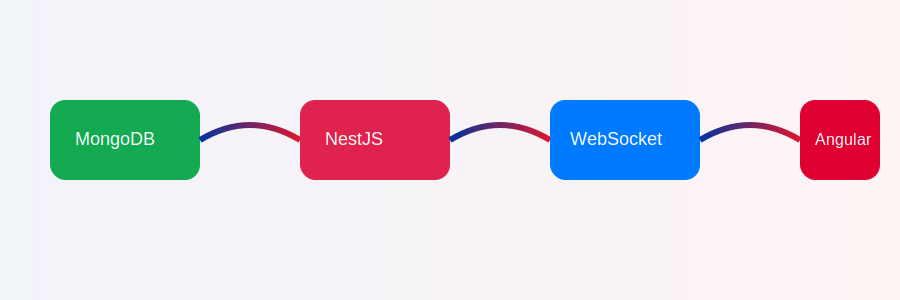
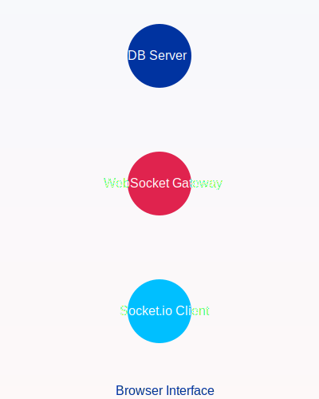

# 🎨 Portfolio

<p align="center">
  
  <br>
  <em>A modern, patriotic web development monorepo blending Angular, NestJS, and Go with best-in-class design.</em>
</p>

<p align="center">
  <a href="https://jeffreysanford.us"></a>
  <a href="https://jeffreysanford.us/api/swagger"></a>
  <a href="https://angular.io/"></a>
  <a href="https://nestjs.com/"></a>
  <a href="https://golang.org/"></a>
</p>

---

## 🏅 Craft Fusion Badges

<p align="center">
  
  
  
  
  
  
</p>

---

## 🔭 Overview

**Craft Fusion** is a modern, enterprise-grade NX monorepo blending Angular, NestJS, and Go backends — themed proudly with American spirit.

🌐 **Live Demo:** [jeffreysanford.us](https://jeffreysanford.us)  
📘 **Swagger Docs:** [API Swagger UI](https://jeffreysanford.us/api/swagger)

---

## 🛠 Tech Stack

- **Monorepo Management:** NX
- **Frontend:** Angular 19 with Material Design 3 (Patriotic Theme)
- **Backend Services:** NestJS & Go
- **Database:** (none required)
- **Real-Time:** WebSockets
- **Documentation:** Markdown + Swagger + Live SVGs

---

## 🧩 Applications

### 🎭 craft-web (Angular Frontend)

- Angular Material 3 UI
- WebSocket streaming
- Accessibility-first, responsive patriotic theme

```bash
nx serve craft-web
```

---

### 🪶 craft-nest (NestJS Backend)

- RESTful API
- WebSocket Gateway
- JWT Authentication + RBAC

```bash
nx serve craft-nest
```

---

### 🚀 craft-go (Go Backend)

- High-throughput parallel API
- Large-scale data optimization
- Mirrors NestJS endpoints for testing

```bash
nx serve craft-go
```

---

## 🕰️ Memorial Timeline Flow

<p align="center">
  
</p>

---

## 🔴 Live Update Architecture

<p align="center">
  
</p>

---

## Crafted in the USA in Legendary North Dakota

<p align="center">
  
</p>

---

## 📚 Documentation

| Document | Description |
|:---------|:------------|
| WEBSOCKET-BEHAVIOR.md | WebSocket Architecture |
| STATE-MANAGEMENT.md | App State Patterns |
| AUTHENTICATION.md | Auth & Authorization |
| API-SERVICE.md | API Architecture |
| See more | Located in `/documentation/` |

---

## � Deployment (Scripts)

Common flows using the repo’s deployment scripts:

- Full deploy (sequential backend then frontend):

  ```bash
  bash scripts/deploy-all.sh
  ```

- Performance-friendly and clean build:

  ```bash
  bash scripts/deploy-all.sh --power --full-clean
  ```

- SSL/WSS setup control:

  ```bash
  # Auto-run SSL/WSS without prompt
  bash scripts/deploy-all.sh --yes-ssl

  # Skip SSL/WSS
  bash scripts/deploy-all.sh --skip-ssl
  ```

- Frontend checks against a custom domain:

  ```bash
  DEPLOY_HOST=example.com bash scripts/deploy-frontend.sh
  ```

See the detailed guide: `documentation/deployment-digital-ocean.md` and the quick guide: `documentation/SIMPLE-DEPLOYMENT.md`.

---

## �📈 Performance Testing

```bash
curl http://localhost:3000/api/records/generate?count=100000
curl http://localhost:4000/records/generate?count=100000
```

---

## 🤝 Contributing

See [CONTRIBUTING.md](documentation/CONTRIBUTING.md).

---

## 👨‍💻 About the Author

**Jeffrey Sanford** — Full-Stack Architect and American Patriot 🇺🇸  
🌐 [jeffreysanford.us](https://jeffreysanford.us)  
💼 [LinkedIn](https://linkedin.com/in/jeffreysanford)  
🐦 [Twitter](https://twitter.com/jeffreysanford)  
📧 [jeffreysanford@gmail.com](mailto:jeffreysanford@gmail.com)

---

## 📜 License

> WITH LOVE License: freely use, modify, and distribute with kindness and patriotism.

---

<p align="center">
🛡️ Built for Freedom • 🚀 Designed for Scale • 🖋️ Crafted with Care
</p>