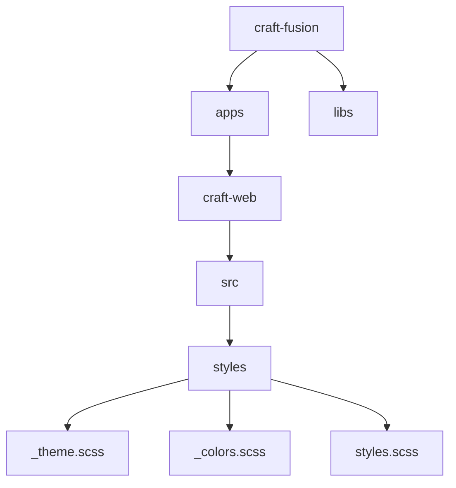
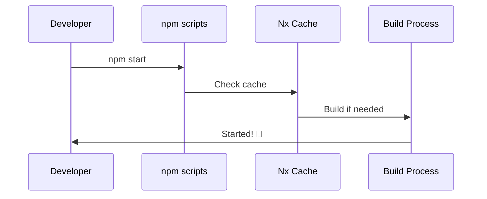
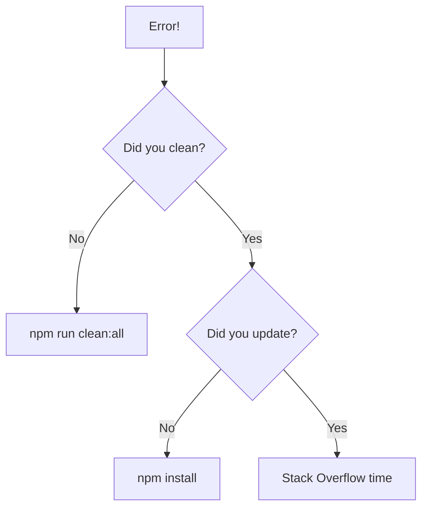
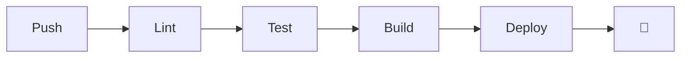

# 🚀 Craft Fusion Installation Guide

## 📋 Required Tools Installation

### Go Installation

```bash
# Windows (using Chocolatey)
choco install golang

# Windows (Manual)
# 1. Download from https://go.dev/dl/
# 2. Run installer
# 3. Verify installation
go version
```

### Node.js Installation

```bash
# Windows (using Chocolatey)
choco install nodejs-lts

# Windows (Manual)
# 1. Download from https://nodejs.org/
# 2. Install Node.js 20.x LTS
# 3. Verify installation
node --version  # Should show v20.x.x
npm --version   # Should show 10.x.x
```

### Global Dependencies

```bash
# Angular CLI
npm install -g @angular/cli@19.0.6

# NX CLI
npm install -g nx@20.3.0

# NestJS CLI
npm install -g @nestjs/cli@10.0.2

# Go Global Tools
go install github.com/golang/mock/mockgen@v1.6.0
go install github.com/swaggo/swag/cmd/swag@latest
```

### Environment Variables

```batch
# Windows - Add to System Environment Variables
GOPATH=%USERPROFILE%\go
GOROOT=C:\Program Files\Go
PATH=%PATH%;%GOPATH%\bin;%GOROOT%\bin
```

## 🔍 Verify Installation

```bash
# Verify versions
go version         # Should show go1.21 or higher
node --version     # Should show v20.x.x
npm --version      # Should show 10.x.x
ng version        # Should show Angular CLI: 19.0.6
nx --version      # Should show 20.3.0
nest --version    # Should show 10.0.2

# Verify global tools
mockgen --version
swag --version
```

## 🚀 Project Setup

### Quick Start

```bash
# Clone and Install
git clone https://github.com/your-repo/craft-fusion.git
cd craft-fusion
npm run install:deps

# Start Development
npm start
```

## 🎯 Common Issues

### Node.js Version Mismatch

```bash
# If you need to switch Node versions, use nvm
nvm install 20
nvm use 20
```

### Go Module Issues

```bash
# Reset Go modules
go clean -modcache
go mod tidy
```

### Angular/NX Cache Issues

```bash
# Clear Angular cache
ng cache clean

# Clear NX cache
npm run clean:cache
```

## 🎨 Project Structure



## 🧰 Prerequisites

- Node.js 20.x
- npm 10.x
- A sense of humor

## 🔄 Development Workflow



## 🧹 Cleanup Commands

| Command | Description | Usage |
|---------|-------------|-------|
| `npm run clean:all` | Nuclear option - cleans everything | When nothing works |
| `npm run clean:cache` | Clears NX cache | When builds act weird |
| `npm run clean:build` | Removes build artifacts | Before production build |
| `npm run clean:deps` | Resets dependencies | When packages fight |

## 🎨 Theme Customization

```scss
// Your brand colors live in _colors.scss
$primary-blue: #002868;  // Navy
$primary-red: #BF0A30;   // Red
```

## 🐛 Troubleshooting

> Q: Why isn't my theme working?
> A: Did you remember to sacrifice a semicolon to the SCSS gods?



## 🚀 CI/CD Pipeline

Our GitHub Actions workflow:



## 📦 Useful Commands

```bash
# Development
npm start                  # Start development server
npm run build             # Build for production
npm test                  # Run tests

# Cleanup
npm run clean:all         # Clean everything
npm run clean:cache       # Clear NX cache
npm run clean:build       # Remove build files
npm run clean:deps        # Reset dependencies

# Other
npm run affected:apps     # Check affected apps
npm run affected:libs     # Check affected libs
```

## 🎭 The Dev Cycle

```plaintext
           Monday
            😊
     Friday     Tuesday
    😫           🤔
    Thursday  Wednesday
         😅

"It works on my machine!"
```

## 🆘 Getting Support

If you encounter issues during installation or development:

### Troubleshooting Steps

1. **Check environment requirements** - Verify your Node, Go, and other dependency versions match requirements
2. **Review logs carefully** - Error messages often contain specific information about what went wrong
3. **Clean and rebuild** - Try `npm run clean:deps` followed by reinstalling dependencies
4. **Check documentation** - Review specific sections of this guide relevant to your issue
5. **Search existing issues** - Your problem may have been encountered and solved before

### Getting Help

- **Team communication** - Post in the `#craft-fusion-dev` channel
- **Issue tracking** - Create a GitHub issue with detailed reproduction steps
- **Technical leads** - Contact the relevant application owner:
  - craft-web: [frontend-lead@example.com](mailto:frontend-lead@example.com)
  - craft-nest: [backend-lead@example.com](mailto:backend-lead@example.com)
  - craft-go: [go-lead@example.com](mailto:go-lead@example.com)
- **Documentation** - Consider improving these docs if you solve a tricky problem

Remember that complex issues may require collaboration to resolve, and properly documenting any solutions will benefit the whole team.

### 🎯 Getting Unstuck

Stuck on something? We've all been there! Try these approaches:

1. **Take a step back**: Sometimes a short break helps solve problems
2. **Check your environment**: Many issues stem from environment mismatches
3. **Ask in the right channel**: Post in `#craft-fusion-help` with details about what you tried
4. **Remember the logs**: Error logs have clues - share them when asking for help

### 💬 Asking Great Questions (and Why We Love Them)

At Craft Fusion, our perfectly structured codebase didn't happen by accident—it evolved through questions, discussions, and collaborative improvements. When you're stuck:

- **Ask with context**: "I'm trying to run the Go API but getting this error after following step 3..."
- **Share what you've tried**: "I've already verified my Go version and tried clearing the module cache..."
- **Explain your goal**: "I'm ultimately trying to test my new endpoint against the local API..."

**Why we value your questions:**

- They help us improve our documentation for everyone
- They often reveal edge cases we hadn't considered
- They create opportunities for us to share best practices and examples
- They show us where our processes could be more intuitive

**Where to ask:**

- `#craft-fusion-help` channel for general help
- GitHub issues for specific bugs
- Team meetings for architectural discussions
- Direct messages to team leads for sensitive questions

Every developer on the team started with questions—they're the foundation of our collaborative learning culture.

## 🧰 Detailed Prerequisites

### Required Software

- Node.js 16.x or higher
- npm 8.x or higher
- Go 1.21+ (for craft-go)
- Docker and Docker Compose
- Git

### System Requirements

- At least 4GB RAM
- 20GB free disk space
- Modern multi-core CPU
- Internet connection for dependency downloads

### Development Environment Recommendations

- VS Code with recommended extensions:
  - ESLint
  - Angular Language Service
  - Go
  - MongoDB for VS Code
  - Docker

## 🚀 Detailed Project Setup

### Initial Repository Setup

```bash
# Clone the repository
git clone https://github.com/your-org/craft-fusion.git
cd craft-fusion

# Install root dependencies
npm install

# Configure environment variables
cp .env.example .env
# Edit .env file to match your environment
```

### Application-Specific Setup

#### Angular Frontend (craft-web)

```bash
# Build the application
nx build craft-web

# Serve for development
nx serve craft-web
```

#### NestJS Backend (craft-nest)

```bash
# Build the application
nx build craft-nest

# Serve for development
nx serve craft-nest
```

#### Go Backend (craft-go)

```bash
# Navigate to Go app directory
cd apps/craft-go

# Initialize Go modules
go mod tidy

# Build application
go build -o craft-go

# Run application
./craft-go
# Or with Nx
nx serve craft-go
```

## 🐳 Docker-Based Development

```bash
# Start all services with Docker Compose
docker-compose up

# Or start specific services
docker-compose up craft-web craft-nest
```

## 🔄 Database Setup

### MongoDB Setup

```bash
# Start a local MongoDB instance
docker-compose up -d mongodb

# Import sample data (optional)
mongorestore --db craft-fusion ./data/sample-data
```

## 🧪 Verifying Installation

After installation, verify that everything is working:

1. Frontend: Visit <http://localhost:4200>
2. NestJS API: Visit <http://localhost:3000/api>
3. Go API: Visit <http://localhost:4000/api/v1/health>

## 💫 First-Time Setup Success Guide

Setting up this project for the first time? We've all been there! Here are some extra tips to make your experience smooth and enjoyable:

### 🔧 Environment Setup Checklist

Use this checklist to ensure everything is properly configured:

- [ ] Node.js version matches requirements (v20.x)
- [ ] Go version is 1.21+ (`go version`)
- [ ] Environment variables are set (especially PATH)
- [ ] MongoDB is accessible (try `mongo --version`)
- [ ] Git is properly configured (`git config --list`)

### 📊 What Does "Success" Look Like?

```ascii
   All Systems Ready!
┌─────────────────────┐
│  ✅ Web Frontend    │
│  ✅ Go API          │
│  ✅ NestJS API      │
│  ✅ Database        │
└─────────────────────┘
```

When everything is working:

- The Angular app shows at <http://localhost:4200>
- The NestJS API responds at <http://localhost:3000/api>
- The Go API responds at <http://localhost:4000/api/v1/health>
- You can access MongoDB data via the API endpoints

### 🚫 Overcoming Common Roadblocks

| Problem | Friendly Solution |
|---------|------------------|
| "Cannot find module..." | Check that you ran `npm install` at the project root! |
| EADDRINUSE error | Another service is using that port. Try finding it with `netstat -ano` |
| Go build errors | Ensure `go mod tidy` ran successfully |
| MongoDB connection error | Verify Mongo is running with `docker ps` or service status |

### 🎯 Getting Unstuck

Stuck on something? We've all been there! Try these approaches:

1. **Take a step back**: Sometimes a short break helps solve problems
2. **Check your environment**: Many issues stem from environment mismatches
3. **Ask in the right channel**: Post in `#craft-fusion-help` with details about what you tried
4. **Remember the logs**: Error logs have clues - share them when asking for help

### 💬 Asking Great Questions (and Why We Love Them)

At Craft Fusion, our perfectly structured codebase didn't happen by accident—it evolved through questions, discussions, and collaborative improvements. When you're stuck:

- **Ask with context**: "I'm trying to run the Go API but getting this error after following step 3..."
- **Share what you've tried**: "I've already verified my Go version and tried clearing the module cache..."
- **Explain your goal**: "I'm ultimately trying to test my new endpoint against the local API..."

**Why we value your questions:**

- They help us improve our documentation for everyone
- They often reveal edge cases we hadn't considered
- They create opportunities for us to share best practices and examples
- They show us where our processes could be more intuitive

**Where to ask:**

- `#craft-fusion-help` channel for general help
- GitHub issues for specific bugs
- Team meetings for architectural discussions
- Direct messages to team leads for sensitive questions

Every developer on the team started with questions—they're the foundation of our collaborative learning culture.

## Last Updated
March 27, 2025
