# 🚀 Craft Fusion Installation Guide (2025 Update)

## 📋 Required Tools Installation

### Go Installation
```bash
# Windows (using Chocolatey)
choco install golang

# Windows (Manual)
# 1. Download from https://go.dev/dl/
# 2. Run installer
# 3. Verify installation
go version
```

### Node.js Installation
```bash
# Windows (using Chocolatey)
choco install nodejs-lts

# Windows (Manual)
# 1. Download from https://nodejs.org/
# 2. Install Node.js 20.x LTS
# 3. Verify installation
node --version  # Should show v20.x.x
npm --version   # Should show 10.x.x
```

### Global Dependencies

```bash
# Angular CLI
npm install -g @angular/cli@19.0.6

# NX CLI
npm install -g nx@20.3.0

# NestJS CLI
npm install -g @nestjs/cli@10.0.2

# Go Global Tools
go install github.com/golang/mock/mockgen@v1.6.0
go install github.com/swaggo/swag/cmd/swag@latest
```

### Environment Variables

```batch
# Windows - Add to System Environment Variables
GOPATH=%USERPROFILE%\go
GOROOT=C:\Program Files\Go
PATH=%PATH%;%GOPATH%\bin;%GOROOT%\bin
```

## 🔍 Verify Installation

```bash
# Verify versions
go version         # Should show go1.21 or higher
node --version     # Should show v20.x.x
npm --version      # Should show 10.x.x
ng version        # Should show Angular CLI: 19.0.6
nx --version      # Should show 20.3.0
nest --version    # Should show 10.0.2

# Verify global tools
mockgen --version
swag --version
```

## 🚀 Project Setup

### Quick Start

```bash
# Clone and Install
git clone https://github.com/your-repo/craft-fusion.git
cd craft-fusion
npm run install:deps

# Start Development
npm start
```

## 🌈 Post-Install System Prep
After installing dependencies, always run:
```bash
bash scripts/system-prep.sh
```
This optimizes your system for memory and process management before any build or deploy.

## 🟩 Environment Variables
All scripts use `.env` for configuration (domain, ports, etc.). Example:
```env
NODE_ENV=production
DOMAIN=jeffreysanford.us
PORT=3000
HOST=0.0.0.0
EXPOSE_API=true
```

## 🖥️ Vibrant Monitoring
For live system health, run:
```bash
bash scripts/memory-monitor.sh
```

## 🎯 Common Issues

### Node.js Version Mismatch
```bash
# If you need to switch Node versions, use nvm
nvm install 20
nvm use 20
```

### Go Module Issues
```bash
# Reset Go modules
go clean -modcache
go mod tidy
```

### Angular/NX Cache Issues
```bash
# Clear Angular cache
ng cache clean

# Clear NX cache
npm run clean:cache
```

## 🎨 Project Structure


## 🧰 Prerequisites

- Node.js 20.x
- npm 10.x
- A sense of humor

## 🔄 Development Workflow

```mermaid
sequenceDiagram
    participant Dev as Developer
    participant NPM as npm scripts
    participant NX as Nx Cache
    participant Build as Build Process
    
    Dev->>NPM: npm start
    NPM->>NX: Check cache
    NX->>Build: Build if needed
    Build->>Dev: Started! 🎉
```



## 🧹 Cleanup Commands

| Command | Description | Usage |
|---------|-------------|-------|
| `npm run clean:all` | Nuclear option - cleans everything | When nothing works |
| `npm run clean:cache` | Clears NX cache | When builds act weird |
| `npm run clean:build` | Removes build artifacts | Before production build |
| `npm run clean:deps` | Resets dependencies | When packages fight |

## 🎨 Theme Customization

```scss
// Your brand colors live in _colors.scss
$primary-blue: #002868;  // Navy
$primary-red: #BF0A30;   // Red
```

## 🐛 Troubleshooting

> Q: Why isn't my theme working?
> A: Did you remember to sacrifice a semicolon to the SCSS gods?


## 🚀 CI/CD Pipeline

Our GitHub Actions workflow:

```mermaid
graph LR
    A[Push] --> B[Lint]
    B --> C[Test]
    C --> D[Build]
    D --> E[Deploy]
    E --> F[🎉]
```



## 📦 Useful Commands

```bash
# Development
npm start                  # Start development server
npm run build             # Build for production
npm test                  # Run tests

# Cleanup
npm run clean:all         # Clean everything
npm run clean:cache       # Clear NX cache
npm run clean:build       # Remove build files
npm run clean:deps        # Reset dependencies

# Other
npm run affected:apps     # Check affected apps
npm run affected:libs     # Check affected libs
```

## 🎭 The Dev Cycle

```
           Monday
            😊
     Friday     Tuesday
    😫           🤔
    Thursday  Wednesday
         😅

"It works on my machine!"
```

## 🆘 Need Help?

1. Try turning it off and on again
2. Run `npm run clean:all`
3. Check StackOverflow
4. Panic
5. Read this doc again
6. Ask for help

---

Remember: The only bad question is the one that breaks the build. 🛠️

*May your builds be green and your coffee be strong!* ☕
