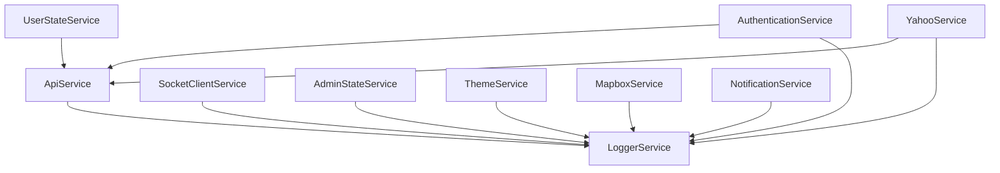

<!-- filepath: c:\repos\craft-fusion\documentation\services\all-services.md -->
# Craft Fusion Services Overview (Deprecated)

> **Note:** This file is deprecated. Please refer to [../../ALL-SERVICES.md](../../ALL-SERVICES.md) for the canonical and up-to-date list of all services in the Craft Fusion project.

## Core Services

| Service | Path | Description |
| :--- | :--- | :--- |
| ApiService | `apps/craft-web/src/app/common/services/api.service.ts` | Handles communication with backend API endpoints |
| AuthenticationService | `apps/craft-web/src/app/common/services/auth/authentication.service.ts` | Manages user authentication and token handling |
| AuthorizationService | `apps/craft-web/src/app/common/services/auth/authorization.service.ts` | Handles user permissions and access control |
| SocketClientService | `apps/craft-web/src/app/common/services/socket-client.service.ts` | Manages WebSocket connections for real-time updates |
| LoggerService | `apps/craft-web/src/app/common/services/logger.service.ts` | Provides application-wide logging capabilities |

## State Management Services

| Service | Path | Description |
| :--- | :--- | :--- |
| UserStateService | `apps/craft-web/src/app/common/services/user-state.service.ts` | Manages user-specific state and preferences |
| AdminStateService | `apps/craft-web/src/app/common/services/admin-state.service.ts` | Handles admin-related state and table performance monitoring |
| SidebarStateService | `apps/craft-web/src/app/common/services/sidebar-state.service.ts` | Controls sidebar collapsed/expanded state |
| FooterStateService | `apps/craft-web/src/app/common/services/footer-state.service.ts` | Manages footer expanded/collapsed state |
| ThemeService | `apps/craft-web/src/app/common/services/theme.service.ts` | Handles application theme (light/dark) |

## Utility Services

| Service | Path | Description |
| :--- | :--- | :--- |
| FileUploadService | `apps/craft-web/src/app/common/services/file-upload.service.ts` | Handles file uploading to the backend |
| NotificationService | `apps/craft-web/src/app/common/services/notification.service.ts` | Displays toast notifications to users |
| BusyService | `apps/craft-web/src/app/common/services/busy.service.ts` | Indicates background activity or loading states |
| ChartLayoutService | `apps/craft-web/src/app/common/services/chart-layout.service.ts` | Provides layout logic for chart components |
| PerformanceConfigService | `apps/craft-web/src/app/common/services/performance-config.service.ts` | Manages application performance settings |
| UserActivityService | `apps/craft-web/src/app/common/services/user-activity.service.ts` | Tracks user interactions within the application |

## Third-Party Integration Services

| Service | Path | Description |
| :--- | :--- | :--- |
| YahooService | `apps/craft-web/src/app/common/services/yahoo.service.ts` | Fetches financial historical data |
| AlphaVantageService | `apps/craft-web/src/app/common/services/alpha-vantage.service.ts` | Fetches stock and forex data |
| FlightRadarService | `apps/craft-web/src/app/common/services/flightradar.service.ts` | Fetches live flight data |
| OpenSkiesService | `apps/craft-web/src/app/common/services/openskies.service.ts` | Fetches flight and airport data |
| MapboxService | `apps/craft-web/src/app/common/services/mapbox.service.ts` | Integrates with Mapbox GL JS for maps |

## Monitoring and Diagnostics Services

| Service | Path | Description |
| :--- | :--- | :--- |
| ApiLoggerService | `apps/craft-web/src/app/common/services/api-logger.service.ts` | Logs API requests and responses |
| ApiDiagnosticsService | `apps/craft-web/src/app/common/services/api-diagnostics.service.ts` | Monitors API connectivity and provides diagnostics |
| PerformanceMonitorService | `apps/craft-web/src/app/common/services/performance-monitor.service.ts` | Monitors application performance metrics |

## Integration Patterns

The services in this application follow several common integration patterns:

1. **Singleton Pattern**: Most services are provided at the root level for application-wide access
2. **Facade Pattern**: Many services expose simple interfaces that abstract complex operations
3. **Observable Pattern**: Services use RxJS observables for reactive state management
4. **Adapter Pattern**: Third-party integrations wrap external APIs in consistent interfaces
5. **Proxy Pattern**: Used for caching, logging, and other cross-cutting concerns

## Service Dependencies

## Related Documentation

- [API Service Architecture](../architecture/api/api-service.md)
- [Authentication](../architecture/auth/authentication.md)
- [WebSocket Behavior](../architecture/websocket-behavior.md)
- [Utilities](./utilities.md)
- [Third-Party Services](./third-party-services.md)
- [Logging](./logging.md)
