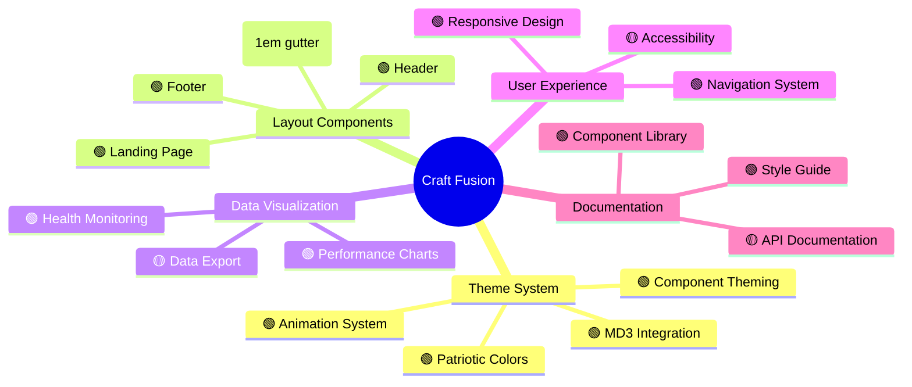
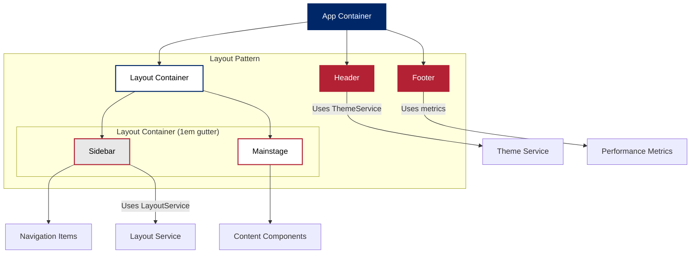

# 🇺🇸 Craft Fusion - Project Status & Visualization 🇺🇸

## 🎯 Project Dashboard



## 🚀 Implementation Progress

```mermaid
gantt
    title Craft Fusion Roadmap
    dateFormat YYYY-MM-DD
    
    section UI Framework
    Theme System           :done, theme1, 2025-01-01, 2025-04-01
    Layout Components      :done, layout1, 2025-01-15, 2025-03-15
    Animation Framework    :done, anim1, 2025-03-01, 2025-04-01
    
    section Features
    Data Visualization     :done, data1, 2025-03-01, 2025-04-05
    Health Monitoring      :done, health1, 2025-02-15, 2025-04-05
    User Management        :active, user1, 2025-04-05, 2025-05-20
    
    section Documentation
    Style Guide            :done, doc1, 2025-02-01, 2025-03-15
    Component Library      :active, doc2, 2025-03-01, 2025-05-01
    API Documentation      :upcoming, doc3, 2025-04-15, 2025-06-01
```

## 🔍 Layout Architecture



## 📊 Component Integration Status

| Component | Status | Build Size | Notes |
|-----------|--------|------------|-------|
| Admin Module | 🟢 Successfully Built | 800.97 kB | Lazy-loaded admin functionality |
| Reports Module | 🟢 Successfully Built | 30.41 kB | Performance metrics visualization |
| Security Settings | 🟢 Successfully Built | - | User security configuration |
| Logger Service | 🟢 Successfully Built | - | Enhanced logging with registerComponent |
| Animation System | 🟢 Successfully Built | - | Fixed transition-list handling |
| Theme System | 🟢 Successfully Built | - | Multiple patriotic themes |

## 🎨 Animation System

The Animation system now includes:

- Fixed transition utilities with proper list handling
- Loading animations (spinner, dots, skeleton)
- Button hover effects with subtle elevation changes
- Patriotic shimmer effects
- Content entrance animations
- Performance-optimized keyframes

```scss
// Example of proper transition-standard mixin usage
@mixin transition-standard($properties...) {
  $transition-list: ();
  @each $property in $properties {
    $transition-list: list.append($transition-list, $property 0.3s cubic-bezier(0.4, 0, 0.2, 1), comma);
  }
  
  @if length($transition-list) > 0 {
    transition: $transition-list;
  } @else {
    transition: all 0.3s cubic-bezier(0.4, 0, 0.2, 1);
  }
}
```

## 🚩 Current Issues & Priority

| Issue | Priority | Status | Owner |
|-------|----------|--------|-------|
| SCSS Variable References | 🟢 Fixed | Complete | UI Team |
| Landing Component Module | 🟢 Fixed | Complete | Core Team |
| App Routes Syntax | 🟢 Fixed | Complete | Core Team |
| Animation System Integration | 🟢 Fixed | Complete | UI Team |
| Log Service Integration | 🟢 Fixed | Complete | Core Team |
| Performance Charts Integration | 🟢 Fixed | Complete | Data Team |
| Accessibility WCAG Compliance | 🟡 Medium | In Progress | A11y Team |

## 🎯 Next Steps

1. **Complete User Management Features**
   - Finish profile settings page
   - Add notification settings component
   - Implement privacy settings component

2. **Enhance Data Visualization**
   - Add export functionality for reports
   - Implement additional chart types
   - Create printable report views

3. **Documentation Updates**
   - Complete API documentation
   - Add examples for all component usage
   - Create developer quickstart guide

4. **Accessibility Improvements**
   - Audit all components against WCAG 2.1 AA
   - Implement keyboard navigation improvements
   - Add screen reader support for data visualizations
